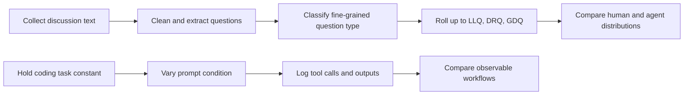
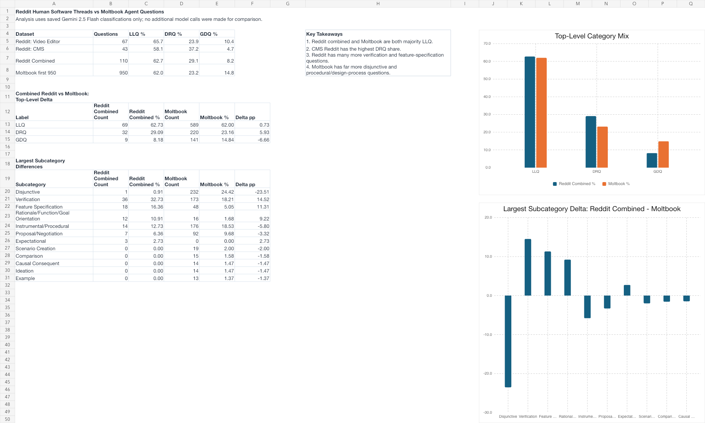

# Observable AI Behavior Research

> A term research project on a practical question: **when we cannot inspect an AI agent's hidden reasoning, what can we learn from the questions it asks and the actions it takes?**

I approached that question from two directions. First, I compared the kinds of questions people ask while discussing software with the kinds of questions agents ask while discussing agent-built tools. Then I built a small experimental harness to observe how an AI coding agent's tool use changes when the prompt changes.

This repository is the complete, curated record of that work: code, cleaned research inputs, analysis outputs, methods, and presentation materials.

## The 30-second version

| I investigated | I built | I found |
| --- | --- | --- |
| Whether observable questions and tool calls can serve as useful traces of agent behavior. | A taxonomy classification pipeline, a human-versus-agent comparison, and a controlled tool-call study. | Human Reddit discussions and Moltbook agent discussions had very similar **top-level question distributions**. Prompt wording also changed the coding agent's observable workflow. |

The key boundary matters: this project does **not** claim to reveal private chain-of-thought. It studies observable behavior: written questions, tool calls, files, commands, tests, and final outputs.

## Research question

AI agents appear to make many decisions after a user sends a prompt. They choose whether to inspect files, call a tool, write code, run a test, or stop. But those internal decisions are not directly available for research.

I asked whether two visible signals could provide a disciplined starting point:

1. **Question patterns** in human and agent discussions. What are they trying to establish, verify, reason through, or propose?
2. **Tool-call traces** in a controlled coding task. How does an agent's sequence of reads, writes, commands, and tests change under different prompt instructions?

## What I did during the term



### 1. Built a question-classification workflow

- Adapted a modular Python pipeline for the Eris question taxonomy.
- Used Gemini 2.5 Flash to classify each question into a **subcategory first**, then roll it up to a top-level bucket.
- Preserved configs, prompts, tests, raw-cleaned question sets, and analysis tables so the work can be audited or rerun.

The top-level buckets are:

| Bucket | Plain-language meaning |
| --- | --- |
| **LLQ** | Low-level questions such as checking a fact, option, or feature. |
| **DRQ** | Deep-reasoning questions such as asking how, why, or what process to follow. |
| **GDQ** | Generative-design questions such as proposing or negotiating a change. |

### 2. Created a human baseline and agent comparison

I cleaned questions from two public Reddit software-build discussions and compared them with the completed first 950 Moltbook agent-question classifications.

| Comparison set | Questions | Role in the study |
| --- | ---: | --- |
| Reddit video-editor discussion | 67 | Human software feedback and support. |
| Reddit CMS/web-development discussion | 43 | Human architecture, feature, and rationale discussion. |
| Reddit combined baseline | **110** | Human comparison sample. |
| Moltbook completed comparison set | **950** | Agent-discussion comparison sample. |

### 3. Built a controlled tool-call study

I held the task constant: build a three-player tic-tac-toe web game. I then varied the prompt across five conditions: minimal, rules-heavy, design-heavy, verification-heavy, and trace-aware.

The harness logs model messages, tool requests, tool results, generated files, commands, and final outputs. I then categorized each action as orientation, implementation, verification, or finalization.

## What I found

### Finding 1. The broad question mix was surprisingly similar

The main comparison is at the top-level bucket because it is a more stable summary than any one fine-grained subcategory.

| Source | Questions | LLQ | DRQ | GDQ |
| --- | ---: | ---: | ---: | ---: |
| Reddit software discussions | 110 | **62.7%** | 29.1% | 8.2% |
| Moltbook agent discussions | 950 | **62.0%** | 23.2% | 14.8% |

Both samples were dominated by low-level questions. That does not mean people and agents reason identically. It means the **high-level distribution of observable question purposes** was close enough to motivate deeper study.



At the subcategory level, the samples differed more: Reddit contained more verification and feature-specification questions, while the Moltbook sample contained more disjunctive questions about alternatives. I treat these as useful diagnostic observations, not the headline result.

### Finding 2. Prompt wording changed the agent's observable workflow

All five tool-call trials completed the app, but they did not take the same route.

| Prompt condition | Observable effect |
| --- | --- |
| Minimal | Completed mainly as a single-file implementation. |
| Rules-heavy | Added explicit game constraints but showed no verification action in the pilot. |
| Design-heavy | Produced the largest non-test HTML artifact, consistent with more styling work. |
| Verification-heavy | Created `test.js` and ran `node test.js` before finalizing. |
| Trace-aware | Split the implementation into `index.html` and `game.js`. |

The pilot supports a modest but useful conclusion: **prompt framing can change not just an agent's final answer, but the observable process used to reach it.**

## What I learned

1. **Observability needs boundaries.** Tool traces and question labels can reveal patterns of action and uncertainty, but they are not a window into hidden reasoning.
2. **Data cleaning is research work.** Extracting genuine questions from scraped discussion text materially affected what could be compared.
3. **Granularity changes reliability.** Fine-grained labels are useful for diagnosis, while top-level buckets are better for the central comparison in this study.
4. **A fair agent study needs controls.** Holding the task, tool set, and logging schema constant made prompt-condition differences interpretable.
5. **Reproducibility is part of the result.** Configs, prompts, datasets, logs, code, examples, and limitations are all included here so the research can be inspected rather than only presented.

## Why this is worth continuing

This work suggests a way to study agent behavior without overclaiming access to private reasoning. The next research steps are clear:

- Expand the Reddit and agent samples across more software contexts.
- Measure label consistency and add human review for boundary cases.
- Run repeated tool-call trials across more models and tasks.
- Add browser and screenshot tools to test richer verification behavior.
- Test whether particular question patterns predict particular tool-use patterns.

## Explore the work

| Start here | What you will see |
| --- | --- |
| [`reddit-vs-moltbook-analysis/analysis_report.md`](reddit-vs-moltbook-analysis/analysis_report.md) | Full comparison, caveats, subcategory diagnostics, and classified examples. |
| [`reddit-vs-moltbook-analysis/reddit_moltbook_question_taxonomy_analysis.xlsx`](reddit-vs-moltbook-analysis/reddit_moltbook_question_taxonomy_analysis.xlsx) | Excel dashboard with charts and source tables. |
| [`question-taxonomy-pipeline/`](question-taxonomy-pipeline/) | Classification code, taxonomy, prompts, provider configs, tests, and cleaned Reddit inputs. |
| [`ai-tool-call-study/analysis/pilot_report.md`](ai-tool-call-study/analysis/pilot_report.md) | Controlled coding-agent pilot and tool-call findings. |
| [`ai-tool-call-study/docs/study_protocol.md`](ai-tool-call-study/docs/study_protocol.md) | Experimental controls, prompt conditions, and trace interpretation. |
| [`presentation/`](presentation/) | Final lightning-talk visuals and research handoff. |

For a short, presentation-ready overview, see [`docs/TERM_RESEARCH_SUMMARY.md`](docs/TERM_RESEARCH_SUMMARY.md).

## Reproduce the studies

### Question taxonomy pipeline

```bash
cd question-taxonomy-pipeline
uv sync
cp .env.example .env
# Add a provider key to .env
uv run python main.py --experiment configs/reddit_browser_video_editor_experiment.yaml
```

### Tool-call study

```bash
cd ai-tool-call-study
uv sync
export GEMINI_API_KEY="your key here"
uv run run-trial --trial-id trial_01_minimal --prompt prompts/trial_01_minimal.txt
uv run analyze-tool-calls --runs-dir runs --out-dir analysis
```

## Limitations

- The Reddit baseline has 110 questions and the Moltbook comparison set has 950. Percentages are more useful than raw counts.
- Reddit inputs came from scraped visible text, not native Reddit API exports, so some UI-text noise can remain.
- The Moltbook comparison uses the completed first 950 classifications, not the full source corpus.
- The tool-call findings are a small pilot with one model and one task.
- The public repository intentionally excludes full raw Moltbook data, raw model batches, credentials, environments, and unrelated projects.

## Attribution and license

The question-taxonomy pipeline is adapted from [ahmedshahriar/llm-eval-question-taxonomy-verbal-design-protocols](https://github.com/ahmedshahriar/llm-eval-question-taxonomy-verbal-design-protocols), released under the Apache License 2.0. The retained license appears in [`question-taxonomy-pipeline/LICENSE`](question-taxonomy-pipeline/LICENSE). Research datasets, analysis, the tool-call harness, and presentation materials were assembled for this study.

Publication scope and data boundaries are documented in [`docs/PROJECT_SCOPE.md`](docs/PROJECT_SCOPE.md).
